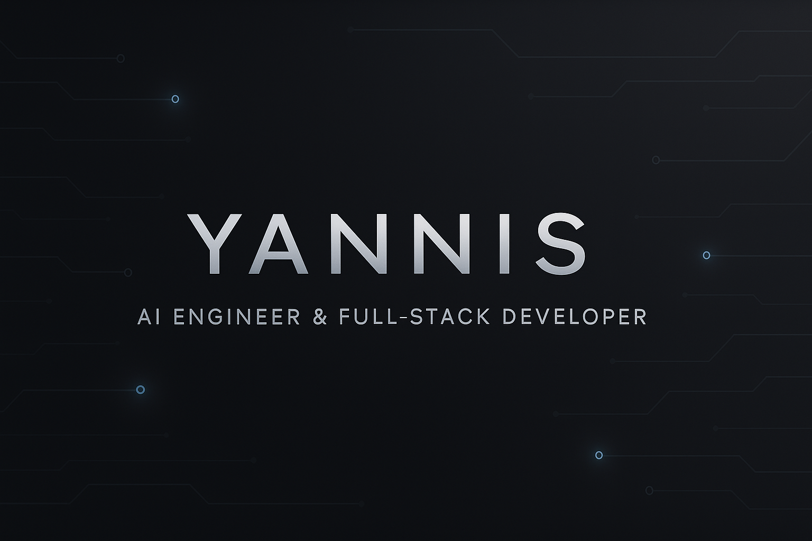

  

# 👋 Hi, I’m Yannis – AI Engineer & Full-Stack Developer

**Curious by nature and driven by clarity, I build intelligent systems to solve real-world problems — one project at a time.**

I'm an AI Engineer in training, focused on building tools powered by LLMs, machine learning, and full-stack development.

My work blends practical problem-solving with technologies like  
**LangChain**, **OpenAI API**, **FastAPI**, **Pinecone**, **Docker**, and **PostgreSQL**.

---

## 🚀 Featured Projects

Here are a few projects where I applied my skills to build real, working solutions.

- 🧠 **AI-Powered Job Application Assistant**  
  RAG-based system that analyzes and matches resumes with job descriptions and generates custom cover letters.  
  *LangChain · OpenAI · FastAPI · Streamlit · Pinecone · PostgreSQL · Docker*

- 📄 **Multi-Source RAG App**  
  Upload documents and ask anything — the app responds intelligently, with fallback to Arxiv and Wikipedia using LangChain agents.  
  *LangChain · OpenAI · Pinecone · Streamlit · RAG* · Docker

- 💬 **Real-Time Chat App**  
  Real-time chatrooms and DMs powered by WebSockets, with secure JWT auth and pub/sub architecture using Redis.  
  *FastAPI · WebSockets · PostgreSQL · Redis · Docker*

---
### 🛠️ Core Tech Stack

#### **Languages**  
  
  
  
  

#### **Frameworks**
  
  
  
  

#### **Data Science & ML**  
  
  

#### **Databases & Infrastructure**  
  
  

#### **Tools & Technologies** 
  
  

---

## 🌱 Currently...

- Sharpening my portfolio and expanding real-world AI projects  
- Exploring opportunities in **AI, backend, or full-stack roles** — remote or international  
- Continuously learning and building tools that are useful, intelligent, and ready to deploy

---
## 🤝 Let’s connect!
I’m always open to exciting ideas, roles, or collaborations.

- 🌐 **Portfolio**: [idalz.github.io](https://idalz.github.io/portfolio)  
- 💼 **LinkedIn**: [linkedin.com/in/idalez](https://www.linkedin.com/in/idalez/)

